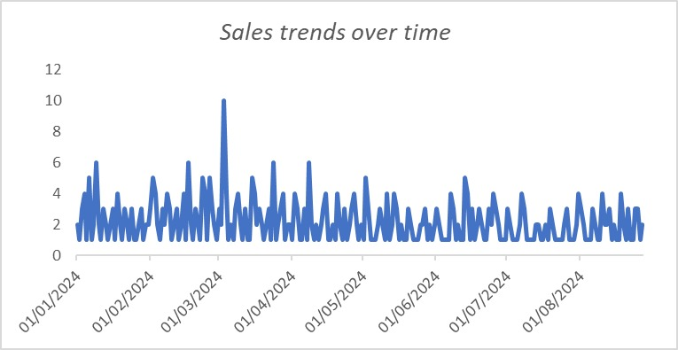
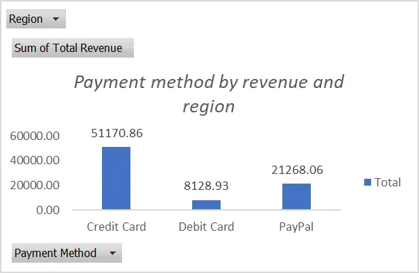
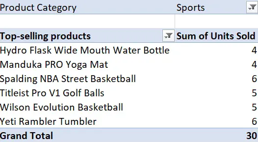
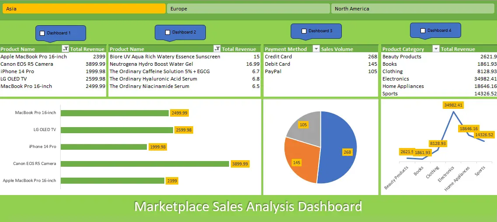

# Online Marketplace Sales Analysis Dashboard

## 📊 Project Overview

This project presents a comprehensive analysis of online sales transactions across multiple product categories, regions, and payment methods. The analysis leverages Excel's advanced features including pivot tables, interactive dashboards, and VBA automation to provide actionable business insights.

---

## 🎯 Business Problem

The organization faces challenges in understanding and optimizing their online marketplace sales performance across multiple dimensions. Key challenges include:

- **Limited visibility** into sales trends and seasonal patterns
- **Fragmented understanding** of product performance across different categories
- **Unclear insights** into regional sales distribution and preferences
- **Inability to analyze** payment method preferences and their impact on revenue
- **Need for dynamic reporting** that allows stakeholders to filter and explore data interactively
- **Requirement for data-driven decision making** to optimize inventory, marketing, and regional strategies

---

## ❓ Business Questions Addressed

### 1. **Temporal Analysis**
- What are the overall sales trends over time?
- When do we see peaks and valleys in sales volume?
- Are there identifiable patterns or seasonality in our sales data?

### 2. **Product Performance**
- Which products are our top sellers by units sold?
- How do different product categories contribute to total revenue?
- What is the product performance within specific categories (e.g., Sports)?

### 3. **Payment Method Insights**
- What is the revenue distribution across different payment methods?
- Which payment method is preferred by customers?
- How does payment method preference correlate with revenue generation?

### 4. **Regional Performance**
- How does sales performance vary across Asia, Europe, and North America?
- Which regions drive the most revenue?
- What are the regional product and payment preferences?

### 5. **Interactive Analysis**
- How can stakeholders dynamically filter data by region?
- How can users switch between different dashboard views for comprehensive analysis?
- What tools enable self-service analytics for decision-makers?

---

## 🛠️ Tools and Technologies Used

### **Microsoft Excel**
- **Pivot Tables**: For data aggregation and multi-dimensional analysis
- **Pivot Charts**: For visual representation of sales metrics
- **Slicers**: For interactive filtering capabilities

### **Visual Basic for Applications (VBA)**
- **Automated Slicer Connections**: Dynamic linking/unlinking of slicers to pivot tables
- **Conditional Logic**: IF-ELSE statements to control dashboard behavior
- **Workbook Object Model**: Manipulation of Excel objects programmatically

### **Data Analysis Features**
- **Time Series Analysis**: Tracking sales trends over daily periods
- **Categorical Analysis**: Comparing performance across product categories
- **Geographic Analysis**: Regional performance comparison
- **Payment Method Analysis**: Revenue distribution by transaction type

### **Dashboard Design**
- **Multi-dashboard architecture**: Four separate dashboards for different analytical perspectives
- **Color coding**: Visual distinction between regions (Yellow for Asia, Green for Europe, Light Green for North America)
- **Interactive elements**: Buttons and slicers for user-driven exploration

---

## 🔍 Key Findings from Analysis

### **1. Sales Trends Over Time**



**Findings:**
- Sales show **significant volatility** with daily fluctuations between 0 and 10 units
- A notable **spike occurred in early March 2024** reaching approximately 10 units
- Multiple **smaller peaks** of 5-6 units appear throughout the period from January to August 2024
- The trend shows **no clear seasonal pattern** but indicates irregular demand cycles
- Average daily sales hover around **2-3 units** with frequent variations

**Implications:**
- High volatility suggests the need for flexible inventory management
- The March spike may indicate a promotional campaign or seasonal event
- Forecasting challenges due to irregular patterns

---

### **2. Payment Method Performance**



**Findings:**
- **Credit Card dominates** with 51,170.86 in total revenue (approximately **55% of total**)
- **PayPal is second** with 21,268.06 in revenue (approximately **23% of total**)
- **Debit Card significantly lags** at only 8,128.93 in revenue (approximately **9% of total**)
- Clear customer preference hierarchy: Credit Card > PayPal > Debit Card
- The Region slicer indicates this view can be filtered by geographic area

**Implications:**
- Credit card infrastructure is critical for business operations
- PayPal integration is valuable and should be maintained
- Debit card adoption is low—may need investigation or promotion
- Payment processing costs should be optimized for credit cards given their dominance

---

### **3. Top-Selling Products (Sports Category)**



**Findings:**
- **Spalding NBA Street Basketball leads** with 6 units sold
- **Titleist Pro V1 Golf Balls** and **Wilson Evolution Basketball** tie at 5 units each
- **Hydro Flask**, **Manduka Yoga Mat**, and **Yeti Rambler Tumbler** each sold 4 units
- **Total of 30 units** sold across these top products in the Sports category
- Relatively **even distribution** suggests diverse customer interests within Sports

**Implications:**
- Basketball products show strong performance (2 of top 3 products)
- Sports category has diverse appeal across multiple sub-categories
- No single product dominates, suggesting opportunity for balanced inventory

---

### **4. Comprehensive Regional Dashboard**



**Findings:**

#### **Asia Region (Yellow Tab)**
- **Top Revenue Products**: Apple MacBook Pro 16-inch ($2,399), Canon EOS R5 Camera ($3,899.99)
- Total revenue dominated by **Electronics category**
- Strong performance in high-value items

#### **Europe Region (Green Tab)**
- **Top Products**: Breo Box Aqua Rich Watery Essence ($15), Neutrogena Hydro Boost ($16.99)
- Focus on **Beauty and Personal Care products** at lower price points
- Higher volume, lower value transactions compared to Asia

#### **North America Region (Light Green Tab)**
- **Product Category Revenue**: Sports ($14,326.52), Home Appliances ($18,646.16), Electronics ($34,982.41 - highest)
- **Payment Method Distribution**: Credit Card (268), Debit Card (145), PayPal (105)
- Electronics category generates the **highest revenue** in North America
- Credit cards are the **dominant payment method**

#### **Payment Method Pie Chart**
- Shows distribution with **Credit Card forming majority** (268 transactions)
- Visual representation confirms credit card preference across the platform

#### **Product Revenue Trend Line**
- Shows fluctuation across categories with **Electronics peaking** at $34,982.41
- Sports shows steady growth trajectory
- Home Appliances maintains mid-range performance at $18,646.16

---

## 💡 Recommendations

### **1. Inventory Management**
- **Implement dynamic inventory systems** to handle high sales volatility
- **Increase safety stock** for products that showed spikes (March peak period)
- **Focus on basketball products** within Sports category given strong performance
- **Maintain diverse Sports product mix** as distribution is relatively even

### **2. Payment Processing Optimization**
- **Negotiate better credit card processing rates** given 55% revenue share
- **Maintain and enhance PayPal integration** as it captures 23% of transactions
- **Investigate debit card underperformance**:
  - Consider promotional incentives for debit card usage
  - Evaluate if processing issues exist
  - Assess if customer demographics align with debit card preference
- **Ensure payment redundancy** to avoid single point of failure

### **3. Regional Strategy**

#### **Asia**
- **Focus on high-value electronics** (MacBooks, cameras)
- **Premium product positioning** strategy
- Consider expanding high-end electronics portfolio

#### **Europe**
- **Emphasize beauty and personal care** products
- **Volume-based approach** with competitive pricing
- Expand skincare and cosmetics offerings

#### **North America**
- **Balanced portfolio approach** across Electronics, Home Appliances, and Sports
- **Leverage electronics strength** ($34,982.41 revenue)
- **Grow Sports category** with targeted marketing
- **Optimize for credit card transactions** (268 out of 518 total)

### **4. Marketing and Promotions**
- **Investigate March spike causes**:
  - If promotional, replicate successful campaigns
  - If seasonal, prepare for annual pattern
  - Document and standardize effective tactics
- **Create targeted campaigns** by region based on product preferences
- **Develop payment-method-specific promotions** to balance transaction types
- **Bundle products** within Sports category to increase average order value

### **5. Dashboard and Analytics**
- **Train stakeholders** on VBA-enabled dashboard functionality
- **Expand slicer capabilities** to include:
  - Product category filters
  - Payment method filters
  - Date range selectors
- **Implement automated reporting** for weekly/monthly performance reviews
- **Create alert systems** for unusual sales patterns or inventory levels

### **6. Data-Driven Decision Making**
- **Establish KPI benchmarks** based on historical performance
- **Monitor payment method trends** monthly to catch shifts early
- **Conduct regional performance reviews** quarterly
- **Track product lifecycle** to optimize inventory refresh cycles
- **Use volatility patterns** to inform demand forecasting models

### **7. Risk Mitigation**
- **Diversify revenue streams** to reduce credit card dependency risk
- **Plan for sales volatility** in cash flow projections
- **Build regional redundancy** so no single region represents excessive risk
- **Monitor payment processor** relationships and have backup options

---

## 🚀 How to Use This Dashboard

### **VBA Slicer Connection Functionality**

The dashboard uses custom VBA code to dynamically connect and disconnect slicers to pivot tables:

```vba
Sub SlicerConnection()
    'Dashboard1
    If Sheet1.Range("A1").Value = True Then
        ActiveWorkbook.SlicerCaches("Slicer_Region").PivotTables.AddPivotTable ( _
            ActiveSheet.PivotTables("PivotTable4"))
    Else
        ActiveWorkbook.SlicerCaches("Slicer_Region").PivotTables.RemovePivotTable ( _
            ActiveSheet.PivotTables("PivotTable4"))
    End If
    
    'Dashboard2
    If Sheet1.Range("D1").Value = True Then
        ActiveWorkbook.SlicerCaches("Slicer_Region").PivotTables.AddPivotTable ( _
            ActiveSheet.PivotTables("PivotTable5"))
    Else
        ActiveWorkbook.SlicerCaches("Slicer_Region").PivotTables.RemovePivotTable ( _
            ActiveSheet.PivotTables("PivotTable5"))
    End If
    
    'Dashboard3
    If Sheet1.Range("G1").Value = True Then
        ActiveWorkbook.SlicerCaches("Slicer_Region").PivotTables.AddPivotTable ( _
            ActiveSheet.PivotTables("PivotTable10"))
    Else
        ActiveWorkbook.SlicerCaches("Slicer_Region").PivotTables.RemovePivotTable ( _
            ActiveSheet.PivotTables("PivotTable10"))
    End If
End Sub
```

### **Steps to Navigate:**

1. **Select Region**: Use the region tabs (Asia, Europe, North America) to filter data
2. **Toggle Dashboards**: Check/uncheck cells A1, D1, or G1 to activate different dashboard views
3. **Run Slicer Connection**: Execute the VBA macro to apply filter connections
4. **Explore Data**: Interact with charts and pivot tables for detailed insights
5. **Export Reports**: Save filtered views for presentations or further analysis

---

## 🙏 Acknowledgments

- Data source: https://www.kaggle.com/code/litsea/online-sales-arima-model/input
- Tools: Microsoft Excel, VBA
- Analysis Framework: Business Intelligence Best Practices

